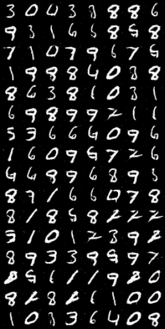
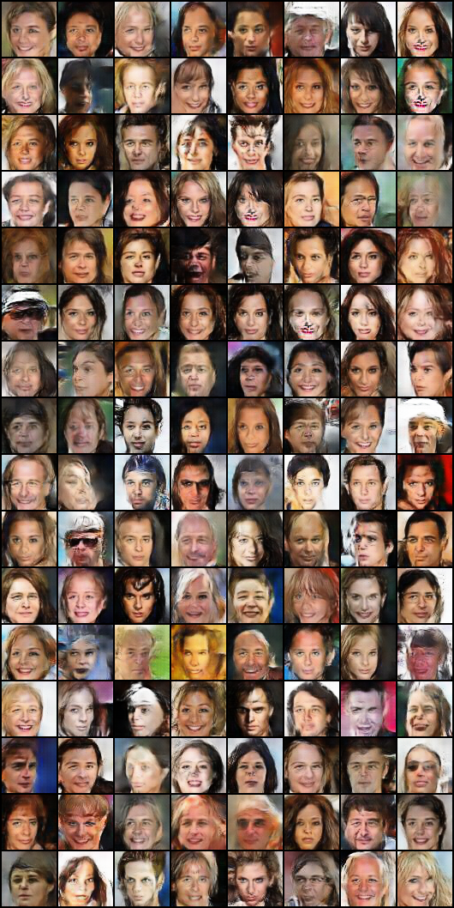

# pytorch-dcgan

### Introduction
Pytorch implementation of [DCGAN](https://arxiv.org/abs/1511.06434) with high extensibility. You can easily extend this code to add more models and datasets.

### Dependencies
* Python 3
* Pytorch 0.4.0

### Usage

#### Train
The default config in `config.py` is set for 'mnist' dataset.

To train the dcgan on 'mnist':

    python main.py

To train the dcgan on 'celeba':

    python main.py --dataset celeba --dataset_root [celeba dataset folder] --c_dim 3 --height 64 --width 64

To train the dcgan on your own dataset:
* implement a dataset loader file in ./datasets/
* modify `get_data_loader()` function in `utils.py`
* train the model

*PS: height and width must be a multiple of 16, see `config.py` to find more details.* 

#### Test
Generate images with trained model.

If 'mnist' dataset:
    
    python main.py --mode test --generator_restored ./results/checkpoints/Generator-final.pt
If 'celeba' dataset or your own dataset:

    python main.py --mode test --c_dim [c] --height [h] --width [w] --generator_restored [model path]

### Generated Result

#### mnist

#### celeba

